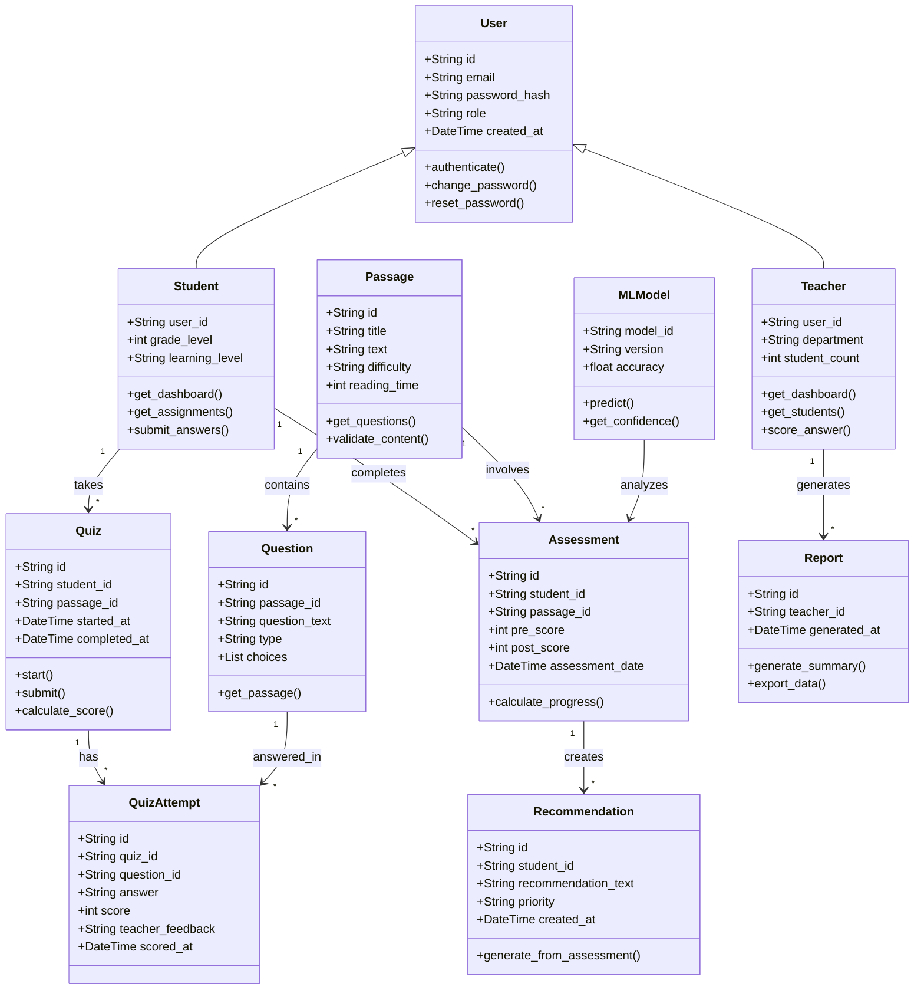
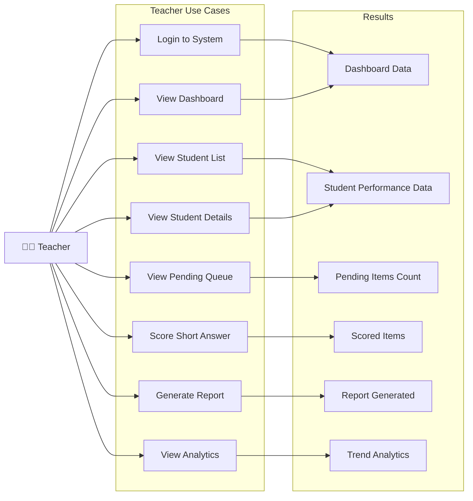
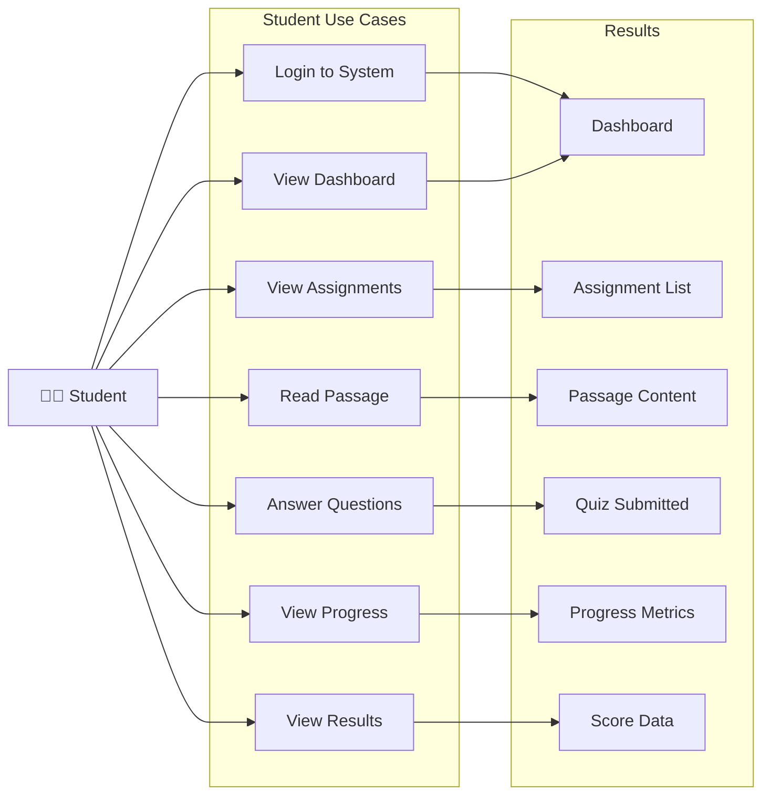
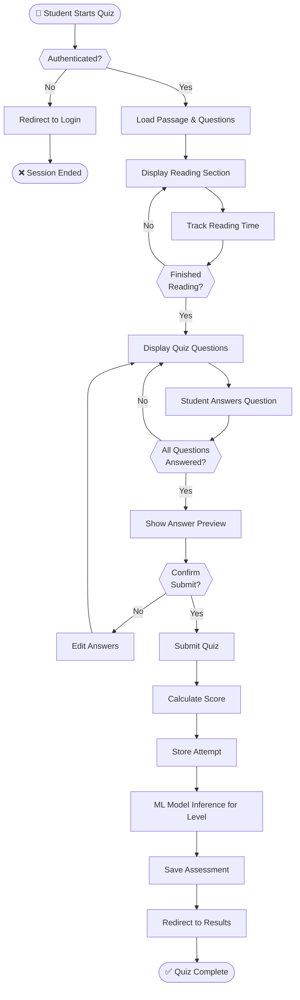
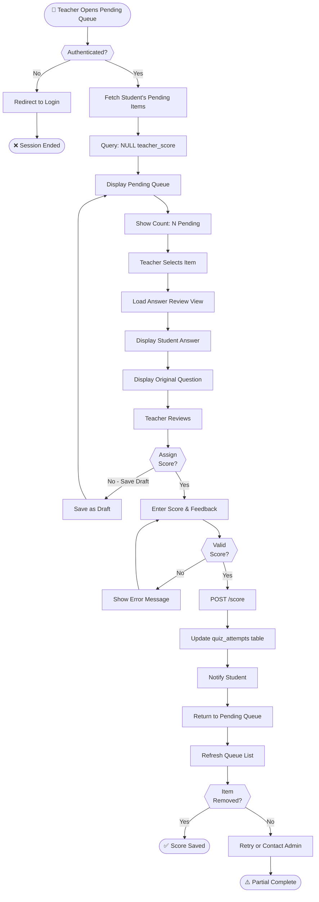
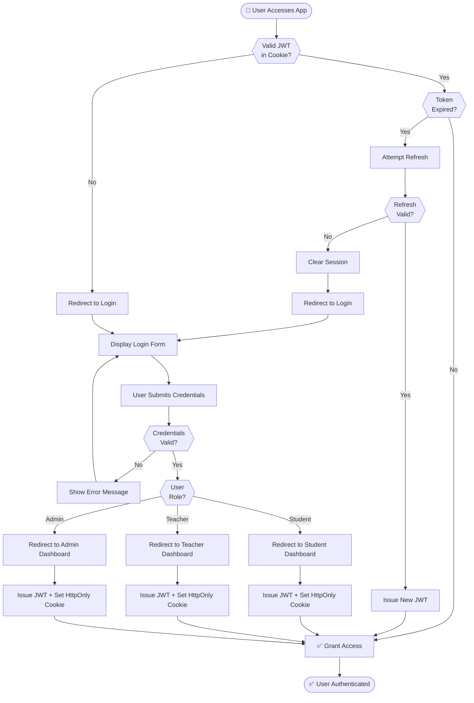

# TalaSaAI Finalization and Production Planning

## Executive Summary

TalaSaAI has a strong prototype foundation: a working Flask backend, role-based flows, teacher/student pages, ML-assisted reading classification, and MySQL persistence. To become production-ready, the project should transition from mixed prototype patterns (mock integrations, inline scripts, monolithic backend file, limited API hardening) into a layered architecture with stricter security, observability, test coverage, and operational readiness.

This plan provides a full production-grade review and roadmap.

---

## 1. Overall System Review

### Current State Assessment

#### Strengths
- Functional end-to-end prototype with teacher/student flows.
- Existing relational schema and seed strategy.
- Role-based access (`teacher`, `student`) already implemented.
- ML model artifacts integrated and callable.
- Multiple education-focused modules already present (reports, recommendations, scoring).

#### Gaps / Risks
- **Monolithic backend (`app.py`)** combines routing, DB access, schema migration, seeding, and business logic.
- Inline scripts in HTML pages reduce maintainability and increase XSS risk surface.
- Mixed state/auth handling patterns (session + token fallback) can cause consistency issues.
- Limited API versioning and endpoint grouping strategy.
- UI components are not modularized; duplication across teacher pages likely.
- No explicit production observability stack (metrics/tracing/alerts).
- No clear environment separation (dev/staging/prod configuration policy).

### Architecture Suitability for Production
- **Prototype-ready:** Yes  
- **Production-ready:** Not yet

### Recommendations
1. Split backend into layers:
   - `routes/controllers`, `services`, `repositories`, `schemas/validators`, `middlewares`.
2. Move schema migrations to dedicated tool (Alembic/Flask-Migrate).
3. Isolate seed scripts from runtime startup.
4. Introduce API versioning (`/api/v1/...`).
5. Replace page-inline JS with modular static assets.
6. Introduce centralized config and secrets manager integration.
7. Add structured logging and monitoring hooks.

---

## 2. UI/UX Review

### General Findings
- Branding is consistent (TalaSaAI look-and-feel), but page-to-page micro-interactions vary.
- Teacher workflow is improving (e.g., pending short-answer queue), but needs unified design language for tables/cards/buttons/states.
- Accessibility and mobile readiness likely partial.

### Detailed Recommendations

#### Consistency
- Standardize:
  - Button hierarchy (Primary, Secondary, Danger, Ghost).
  - Card spacing, border radius, typography scale, status badge styles.
  - Toast/message patterns (success/error/warning/info).

#### Navigation Flow
- Add persistent breadcrumbs with consistent back behavior.
- Add contextual return links preserving source context (already partially applied via query flags).
- Add active section indicators in sidebar and page subtitle.

#### Responsive + Mobile
- Create breakpoints (e.g., 1200, 992, 768, 576).
- Convert dense tables into responsive cards on small screens.
- Ensure touch target sizes (>= 44px).

#### Accessibility
- Add semantic landmarks, labels, ARIA where needed.
- Keyboard navigation coverage for all controls.
- Color contrast audit (WCAG AA).
- Screen reader-friendly status updates.

#### States
- Add complete:
  - Loading skeletons
  - Empty states with clear call-to-action
  - Error retry states
  - Confirmation dialogs for destructive/critical actions

#### Professional Platform Feel
- Add top-level “Today’s Tasks”/“At Risk Students” summary cards.
- Introduce progress indicators, trend arrows, and actionable insights.
- Add bulk actions where possible (assignment/review batching).

---

## 3. Complete User Flow Review

### Teacher Flow (Target)
1. Login
2. Dashboard summary
3. Student list/filter/search
4. Student detail
5. Pending short-answer queue
6. Scoring page
7. Save score and return to queue
8. Recommendations/reports
9. Logout

#### Improvements
- Add queue navigation controls (next pending item shortcut).
- Add scoring audit trail view.
- Add consistency for “back to source” across all teacher actions.
- Add filters by class/section/week/difficulty/status.

### Student Flow (Target)
1. Login
2. Dashboard (assigned tasks)
3. Passage reading
4. Comprehension questions
5. Short-answer submission
6. Results and recommendation
7. Progress/history
8. Logout

#### Improvements
- Add explicit “incomplete task” resumption flow.
- Add motivational progress milestones.
- Add lock/unlock logic transparency (reading timer states).
- Add student-visible feedback history for graded short answers.

### Missing / Unnecessary Steps
- Missing: explicit onboarding and account recovery.
- Missing: notification center for “new assignment” / “feedback available”.
- Possibly unnecessary: duplicate navigation paths causing confusion between detail and queue pages if not context-aware.

---

## 4. Database Design (Production Relational Model)

## 4.1 ER Overview (Textual)

- **users** (1) — (0..1) **teachers**
- **users** (1) — (0..1) **students**
- **sections** (1) — (N) **students**
- **classes** (1) — (N) **sections**
- **passages** (1) — (N) **questions**
- **questions** (1) — (N) **choices** (for choice-type)
- **students** (1) — (N) **reading_sessions**
- **reading_sessions** (1) — (N) **student_answers**
- **student_answers** (1) — (0..1) **short_answer_scores**
- **students** (1) — (N) **recommendations**
- **students** (1) — (N) **reading_history**
- **teachers** (1) — (N) **reports**
- **users** (1) — (N) **audit_logs**
- **users** (1) — (N) **notifications**
- **settings** system-wide singleton or scoped records

## 4.2 Suggested Tables

1. `users`
- id (PK), email (UNIQUE), password_hash, role, is_active, created_at, updated_at

2. `teachers`
- id (PK), user_id (FK users.id, UNIQUE), full_name, department, created_at

3. `students`
- id (PK), user_id (FK users.id, UNIQUE), full_name, class_id (FK classes.id), section_id (FK sections.id), reading_level_id (FK reading_levels.id), created_at

4. `classes`
- id (PK), grade_level, curriculum_code, adviser_teacher_id (FK teachers.id)

5. `sections`
- id (PK), class_id (FK classes.id), name, school_year

6. `passages`
- id (PK), title, genre, content, difficulty_level, source, is_active, created_by (FK teachers.id), created_at

7. `questions`
- id (PK), passage_id (FK passages.id), type, prompt, sequence_no, metadata_json

8. `choices`
- id (PK), question_id (FK questions.id), choice_text, is_correct, sequence_no

9. `reading_sessions`
- id (PK), student_id (FK students.id), passage_id (FK passages.id), week_no, started_at, completed_at, duration_seconds, status

10. `student_answers`
- id (PK), session_id (FK reading_sessions.id), question_id (FK questions.id), answer_payload_json, is_correct_nullable, submitted_at

11. `short_answer_responses`
- id (PK), student_answer_id (FK student_answers.id, UNIQUE), response_text, needs_manual_review, submitted_at

12. `short_answer_scores`
- id (PK), short_answer_response_id (FK short_answer_responses.id, UNIQUE), teacher_id (FK teachers.id), score_binary, feedback, scored_at

13. `scores`
- id (PK), session_id (FK reading_sessions.id), objective_score_pct, short_answer_score_pct, total_score_pct, computed_at

14. `reading_levels`
- id (PK), code (EASY/MODERATE/HARD), description, threshold_min, threshold_max

15. `recommendations`
- id (PK), student_id (FK students.id), source_type (rule/ml), recommendation_text, suggested_level_id (FK reading_levels.id), created_at

16. `reading_history`
- id (PK), student_id (FK students.id), session_id (FK reading_sessions.id), summary_json, created_at

17. `reports`
- id (PK), teacher_id (FK teachers.id), report_type, report_payload_json, generated_at

18. `audit_logs`
- id (PK), user_id (FK users.id), action, entity_type, entity_id, before_json, after_json, ip_address, user_agent, created_at

19. `notifications`
- id (PK), user_id (FK users.id), type, title, message, is_read, created_at

20. `settings`
- id (PK), scope, key, value_json, updated_by (FK users.id), updated_at

## 4.3 Normalization
- Model is 3NF compliant: facts stored once, no repeating groups, dependencies on key.
- Controlled denormalization only for read-heavy analytics/reporting materialized views.

## 4.4 Constraints & Indexes
- Unique: users.email, token values, one-to-one profile tables
- FK constraints on all relationship columns
- Indexes:
  - `reading_sessions(student_id, week_no)`
  - `student_answers(session_id, question_id)`
  - `short_answer_responses(needs_manual_review, submitted_at)`
  - `short_answer_scores(teacher_id, scored_at)`
  - `audit_logs(user_id, created_at)`
  - `notifications(user_id, is_read)`

---

## 5. Backend Architecture Review

### Current Issues
- Tight coupling of HTTP layer and DB/business logic.
- Initialization logic (schema/seed) in runtime app path.
- Limited middleware chain standardization.

### Recommended Architecture
- `controllers`: HTTP request/response mapping only
- `services`: business rules
- `repositories`: SQL/data persistence
- `schemas`: input/output validation (Pydantic/Marshmallow)
- `middlewares`: auth, rate limit, request ID, error handling
- `jobs/workers`: async tasks (report generation, notifications)

### Additional Enhancements
- Global exception mapper
- Structured error envelope
- Idempotency keys for write endpoints
- Correlation IDs for request tracing

---

## 6. Production-Ready API Design

Base: `/api`

### Authentication Endpoints
- `POST /api/auth/login` — Login with email/password/role
- `POST /api/auth/logout` — Logout and clear session
- `GET /api/auth/me` — Get current authenticated user

### Student Endpoints (Reading & Progress)
- `GET /api/student/weekly-passages?week={week}` — Get assigned passages for student in week
- `GET /api/student/completions?week={week}` — Get completed passages for week
- `GET /api/student/attempts?passageId={id}&week={week}` — Get student's quiz attempt for passage
- `POST /api/student/attempts` — Submit quiz attempt/answers
- `POST /api/student/reading-time` — Log reading time for passage
- `GET /api/student/reading-progress?week={week}&passageId={id}` — Get reading progress (scroll position, time spent)
- `POST /api/student/reading-progress` — Save reading progress while reading
- `POST /api/student/reading-lock` — Lock reading section (prevent returning to read)
- `POST /api/student/pre-assessment` — Submit pre-assessment answers for adaptive level
- `GET /api/student/progress` — Get overall student progress dashboard
- `PUT /api/student/profile/avatar` — Update student avatar/profile picture

### Teacher Endpoints (Dashboard & Scoring)
- `GET /api/teacher/dashboard` — Get teacher dashboard summary
- `GET /api/teacher/students` — Get list of teacher's students with metrics
- `GET /api/teacher/students/{studentId}` — Get individual student detail and performance
- `GET /api/teacher/students/{studentId}/pending-short-answers` — Get pending short-answer queue for student
- `POST /api/teacher/score` — Submit score and feedback for short-answer question
- `GET /api/teacher/reports/summary?activeWeek={week}` — Get summary report (by week or all-time)
- `POST /api/teacher/students/{studentId}/apply-recommendation` — Auto-adjust student level based on ML recommendation
- `POST /api/teacher/students/{studentId}/override-level` — Manually override student reading level with reason

### Admin Endpoints (User Management)
- `GET /api/admin/students` — Get all students
- `POST /api/admin/students` — Create new student
- `PUT /api/admin/students/{studentId}` — Update student (name, email, grade, etc.)
- `DELETE /api/admin/students/{studentId}` — Delete student
- `GET /api/admin/teachers` — Get all teachers
- `POST /api/admin/teachers` — Create new teacher
- `PUT /api/admin/teachers/{teacherId}` — Update teacher info
- `DELETE /api/admin/teachers/{teacherId}` — Delete teacher
- `GET /api/admin/users?role={role}` — Get all users, optionally filtered by role (student/teacher/admin)
- `POST /api/admin/users` — Create new user with role
- `PUT /api/admin/users/{userId}` — Update user details
- `DELETE /api/admin/users/{userId}` — Delete user

### Passage Management Endpoints
- `GET /api/passages` — Get all passages (with difficulty, reading time, metadata)
- `POST /api/passages` — Create new passage
- `PUT /api/passages/{passageId}` — Update passage content/metadata
- `DELETE /api/passages/{passageId}` — Delete passage
- `POST /api/passages/import-csv` — Bulk import passages from CSV

### Admin Passage Management
- `GET /api/admin/passages` — Get all passages (admin view with additional metadata)
- `POST /api/admin/passages` — Create passage (admin)
- `PUT /api/admin/passages/{passageId}` — Update passage (admin)
- `DELETE /api/admin/passages/{passageId}` — Delete passage (admin)

### Assignments & Program Settings Endpoints
- `GET /api/assignments?week={week}` — Get assignments for week (passage → class level mappings)
- `POST /api/assignments` — Assign passage to class level for specific week
- `DELETE /api/assignments` — Remove assignment
- `GET /api/program/week` — Get current active week
- `GET /api/program/week/settings` — Get week settings (manual override, start date, etc.)
- `PUT /api/program/week/settings` — Update week settings (e.g., manually override active week)

### Standard Response Envelope
```json
{
  "ok": true,
  "data": {},
  "meta": {
    "requestId": "..."
  }
}
```

### Error Response Format
```json
{
  "ok": false,
  "error": "Description of error",
  "meta": {
    "requestId": "..."
  }
}
```

### Authentication & Authorization
- JWT access token stored in localStorage and sent in `Authorization: Bearer <token>` header
- Fallback `X-Auth-Token` header support
- Credentials included in all requests (httpOnly cookies for refresh token support)
- Role-based access control: `student`, `teacher`, `admin`
- 401 responses automatically clear cached user and redirect to login

---

## 6.1 Functional Design

### System Class Diagram



### Use Case Diagram - Teacher Workflow



### Use Case Diagram - Student Workflow



### Activity Diagram - Student Quiz Flow



### Activity Diagram - Teacher Scoring Flow



### Activity Diagram - Authentication & Session Flow



---

## 7. Authentication & Authorization

### Recommendations
- JWT access token (short-lived, e.g., 15m)
- Refresh token (httpOnly secure cookie, rotation enabled)
- Password hashing with Argon2id (preferred) or bcrypt
- RBAC + permission matrix (teacher/student/admin)
- Session invalidation on credential reset
- Email verification and password reset flow
- Optional MFA for teacher/admin accounts

---

## 8. Security Review (Risk Matrix)

| Area | Risk | Severity | Mitigation |
|---|---|---|---|
| SQL Injection | Dynamic query misuse | High | Parameterized queries everywhere, repository layer tests |
| XSS | Inline rendering without encoding | High | Strict escaping, CSP, avoid unsafe HTML injection |
| CSRF | Cookie-based auth endpoints | High | CSRF tokens + SameSite + origin checks |
| Auth flaws | Mixed token/session confusion | High | Single auth strategy with refresh model |
| Authorization | IDOR on student resources | High | Role + ownership checks in service layer |
| File uploads | Malicious content | High | MIME/type validation, scanning, size limits, storage isolation |
| Secrets leakage | Hardcoded/weak secrets | High | Vault/secret manager, env policy |
| Brute force | Login endpoint abuse | Medium | Rate limit + lockout + captcha threshold |
| CORS misconfig | Broad origins | Medium | Strict allowlist by env |
| Dependency vulns | Outdated libs | Medium | SCA scanning, pinned versions, patch cadence |
| Sensitive logging | PII/token leak in logs | Medium | Log redaction + privacy policy |
| Security headers | Missing headers | Medium | HSTS, X-Frame-Options, X-Content-Type-Options, CSP |

---

## 9. Machine Learning Integration Review

### Current
- SVM model loaded in app process.
- Feature extraction + inference in request path.

### Options

1. **Keep SVM in monolith**
- Pros: simple deployment
- Cons: tighter coupling, scale bottlenecks

2. **Convert model to ONNX**
- Pros: faster inference portability
- Cons: conversion/validation effort

3. **Python microservice (FastAPI)**
- Pros: independent scaling/versioning, cleaner boundaries
- Cons: operational complexity (service-to-service)

4. **Export parameters + rule engine**
- Pros: lightweight deployment for deterministic logic
- Cons: may reduce model flexibility/performance

### Recommendation
- Near term: keep SVM but isolate in service module and add model version metadata.
- Mid term: move to dedicated ML inference microservice with versioned models and A/B validation.

---

## 10. Performance Optimization

### Frontend
- Bundle/minify JS/CSS
- Split page scripts
- Lazy-load non-critical assets
- Optimize images and cache headers

### Backend
- Add pagination for lists
- Optimize hot queries with indexes
- Connection pooling tuning
- Cache read-heavy endpoints (Redis)

### Database
- EXPLAIN plans on key endpoints
- Composite indexes for queue/report queries
- Archive old audit/events to cold storage

### API
- gzip/brotli compression
- request/response size limits
- timeout and retry strategy

---

## 11. Code Quality Review

### Issues
- Large function/file sizes in backend
- Inline JS/CSS-heavy page logic
- Potential duplication across pages

### Improvements
- Enforce linting/formatting (ESLint/Prettier, Black/isort/flake8)
- Add type hints and stricter validation schemas
- Refactor repeated UI utilities into shared modules
- Improve testability by isolating logic from DOM/HTTP layers
- Add ADRs and architecture docs

---

## 12. Deployment Architecture (Recommended)

### Reference Setup
- Frontend: static hosting (Vercel/Netlify or Nginx)
- Backend API: containerized app on Render/Railway/DigitalOcean/AWS ECS
- Database: managed PostgreSQL/MySQL
- Cache: Redis (managed)
- Reverse proxy: Nginx / cloud load balancer
- TLS: Let’s Encrypt / managed cert
- CI/CD: GitHub Actions (build, test, scan, deploy)
- Monitoring: Prometheus/Grafana + Sentry
- Logging: centralized (ELK/Cloud logging)
- Backups: daily automated + PITR
- Health checks: `/health`, `/api/health`, dependency checks
- DR: restore runbook + RTO/RPO targets

---

## 13. Recommended Tech Stack

### Option A (Incremental from current)
- Frontend: HTML/CSS/Vanilla JS (modularized)
- Backend: Flask + SQLAlchemy + Marshmallow/Pydantic
- DB: PostgreSQL (or MySQL managed)
- Auth: JWT + Refresh tokens
- ML: FastAPI microservice (scikit-learn)
- Hosting: Render/Railway (fast rollout)

### Option B (Long-term scale)
- Frontend: React + TypeScript
- Backend: Node.js (NestJS/Express) or Python FastAPI
- DB: PostgreSQL
- Auth: JWT + RBAC service
- ML: Dedicated inference service
- Hosting: AWS (ECS/RDS/CloudFront)

### Why suitable
- Clear separation of concerns
- Better maintainability and hiring familiarity
- Scalable deployment patterns
- Strong ecosystem for security/testing/monitoring

---

## 14. Final Production Checklist

## UI/UX
- [ ] Unified design system
- [ ] Responsive + accessibility audit complete
- [ ] Loading/empty/error/success states complete
- [ ] Consistent navigation and breadcrumbs

## Database
- [ ] Final schema migrated with versioned migrations
- [ ] FK/constraints/indexes validated
- [ ] Seed scripts separated from runtime

## Backend
- [ ] Layered architecture implemented
- [ ] API versioning + validation + error standards
- [ ] Rate limiting and request tracing enabled

## Frontend
- [ ] Modular JS, no critical inline script dependency
- [ ] Input validation + output escaping everywhere
- [ ] Asset optimization complete

## ML
- [ ] Model versioning metadata
- [ ] Drift/performance monitoring plan
- [ ] Fallback strategy for inference failures

## Security
- [ ] CSRF/XSS/SQLi controls verified
- [ ] Secret management and rotation policy
- [ ] Dependency vulnerability scans clean
- [ ] Security headers + HTTPS enforced

## Authentication
- [ ] Access + refresh token flow
- [ ] RBAC enforcement tested
- [ ] Password reset and email verification

## Testing
- [ ] Unit, integration, e2e coverage targets met
- [ ] Critical teacher/student flows passed
- [ ] API contract tests and load smoke tests passed

## Documentation
- [ ] API docs (OpenAPI)
- [ ] Runbook + incident response
- [ ] Admin/teacher user guide

## Deployment/Operations
- [ ] CI/CD with rollback
- [ ] Monitoring + alerts + dashboards
- [ ] Backups + restore drill successful
- [ ] Staging signoff done

---

## 15. Project Roadmap (Phased)

## Phase 1 — Finalize UI/UX
**Objectives:** Consistent, accessible, responsive interface  
**Tasks:** Design system, state handling, navigation cleanup  
**Deliverables:** UI kit + updated pages  
**Dependencies:** Stakeholder review  
**Risks:** Scope creep in redesign

## Phase 2 — Replace Mock Data with Real DB
**Objectives:** Persist all core entities  
**Tasks:** Final schema, migrations, repositories  
**Deliverables:** Production schema + data access layer  
**Dependencies:** Phase 1 entity alignment  
**Risks:** Data integrity issues during migration

## Phase 3 — Backend APIs
**Objectives:** Stable REST API surface  
**Tasks:** Versioned endpoints, validation, contracts  
**Deliverables:** `/api/v1` complete services  
**Dependencies:** Phase 2  
**Risks:** Breaking changes without contract tests

## Phase 4 — Auth & Authorization
**```md
# TalaSaAI Critical-Path Test + Return-to-Pending Workflow (MD Plan)

## Goal
Verify the teacher critical workflow:
1) Open a student’s pending queue page (`teacher-student-pending.html?sid=...`)
2) Open scoring for a pending item
3) Save the score
4) Confirm teacher is redirected back to the pending queue (`teacher-student-pending.html?sid=...`)
5) Confirm the scored item is no longer in the pending list (queue updates)

## Scope (Affected UI + Logic)
### UI pages
- `pages/teacher-student-pending.html`
- `pages/teacher-score.html`
- (Optional sanity) `pages/teacher-student-detail.html` (count + “check all pending” link)

### Backend endpoint (behavior validation)
- `GET /api/teacher/students/<student_id>/pending-short-answers`
- `POST /api/teacher/score`

## Pre-conditions
- App server running (Python `app.py`)
- Teacher credentials valid:
  - email: `ms.villanueva@pnhs.edu`
  - password: `teacher123`
- Student id to test (example from your earlier run):
  - `sid = s9`

## Test Data Checks (DB sanity, optional but recommended)
Before running UI steps, confirm DB has multiple pending short-answer records for `s9`:
- Pending item definition:
  - `quiz_attempts.short_answer_text IS NOT NULL`
  - `quiz_attempts.teacher_score IS NULL`
  - `quiz_attempts.student_id = <sid>`

(If you can’t query DB directly, use the UI pending page to confirm count >= 2.)

---

## Critical-Path Test Suite (Teacher)

### TC-CRIT-01: Pending page loads and shows queue count
**Steps**
1. Login as teacher.
2. Open:
   - `http://localhost/readwise/pages/teacher-student-pending.html?sid=s9`
3. Observe:
   - Queue header shows: “Pending Short Answers • …”
   - Queue count text is visible
   - List contains multiple “Pending #” cards
**Expected**
- HTTP requests succeed (no 401)
- Pending count matches number of cards shown

**Evidence**
- Screenshot of pending queue list + count

---

### TC-CRIT-02: Open scoring view from pending queue
**Steps**
1. On pending page, click `Open Scoring View` on the first pending card.
2. Verify scoring page loads the correct student/passage/prompt/response.
3. Confirm scoring page URL contains:
   - `sid=s9`
   - `pid=<passageId>`
   - `from=pending`
**Expected**
- Scoring page shows a pending short-answer response
- URL includes `from=pending`

**Evidence**
- Screenshot of scoring page + URL bar showing `from=pending`

---

### TC-CRIT-03: Save score and redirect back to pending page
**Steps**
1. On scoring page:
   - Choose score `1` (Correct) or `0` (Incorrect)
   - (Optional) Add feedback
2. Click `Save Score`
3. After redirect, confirm landing page is:
   - `teacher-student-pending.html?sid=s9`
4. Confirm the scored item is no longer visible as a pending card.
**Expected**
- Redirect goes back to pending queue page (not student detail)
- Queue count decreases by 1
- The specific passage/prompt that was scored is removed from pending list

**Evidence**
- Before/after screenshots of pending queue cards & count

---

### TC-CRIT-04: Edge fallback (open score view without `from=pending`)
**Steps**
1. Open scoring page directly *without* `from=pending`, e.g.:
   - `teacher-score.html?sid=s9&pid=<somePassageId>`
   (You can take `pid` from one of the pending items)
2. Save score.
3. Verify redirect behavior:
   - Should go to `teacher-student-detail.html?id=<sid>`
   - (current fallback behavior)
**Expected**
- Redirect is NOT to pending queue (unless `from=pending` exists)

**Evidence**
- Screenshot of redirect destination after saving

---

## Backend/API Validation (Lightweight, optional but recommended)
If you can use Curl or an API client, validate:

### API-01: Authorized pending-short-answers returns array
**Checks**
- `GET /api/teacher/students/s9/pending-short-answers`
- Response includes:
  - `student`
  - `pendingShortAnswers: [...]` (length >= 1)

### API-02: Unauthorized returns 401/403
- Call without teacher auth/session
**Expected**
- Access denied, no data returned

### API-03: Score save updates pending state
- After `POST /api/teacher/score`, repeat pending GET
**Expected**
- Item previously scored now has `teacher_score != NULL`, so it disappears from pending list

---

## Pass/Fail Criteria
- **PASS** if:
  - Pending page shows all pending items
  - “Open Scoring View” works for each item
  - “Save Score” redirects back to pending page when opened from pending queue
  - Queue updates after scoring (count/card removal)
- **FAIL** if:
  - Redirect goes to wrong page
  - Pending list does not update
  - 401/403 blocks the critical path
  - Scoring loads wrong/blank data

---

## Execution Order (Recommended)
1. TC-CRIT-01
2. TC-CRIT-02
3. TC-CRIT-03
4. TC-CRIT-04
5. (Optional) backend checks API-01..03

---
## Deliverables for Instructor Presentation
- 1 screenshot: pending page (`teacher-student-pending.html?sid=s9`) showing count and 3 cards
- 1 screenshot: scoring page with `from=pending`
- 1 screenshot: pending page after saving (count decreased and item removed)
- 1 screenshot: fallback edge redirect (no `from=pending`) OR a statement confirming it works

---

## Notes / Known Constraints
- If a 401 occurs during login/session, re-login as teacher and retry the steps.
- Queue content relies on `quiz_attempts.teacher_score IS NULL`.
